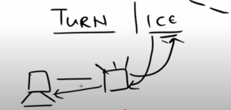

## **WebRTC**  

    

  

- WebRTC is **built into modern browsers**, requiring no third-party cloud or external servers.  
- Once **two browsers are connected**, users can:  
  - **Live share video**  
  - **Chat in real-time**  
  - **Transfer files with no limits**  
- **Truly Unlimited!** – No extra setup required.  

---

## **Protocols**  
  

### **TCP (Transmission Control Protocol)**  
- Ensures **all packets reach** the end-user.  
- Used in applications like:  
  - **WhatsApp messaging** (text delivery guarantee).  
  - **Website searches** (ensuring full page loads).  
- Requires a **server** to manage data transmission.  

### **UDP (User Datagram Protocol)**  
- **Faster but data loss may occur**.  
- Used in:  
  - **Live cricket streaming** (occasional lags).  
  - **Video calls** (words may be skipped due to network fluctuations).  
- WebRTC **works on UDP** – ensuring:  
  - **High-speed** communication.  
  - **No server required**.  
  - **Drawback:** Not ideal for file sharing (data loss risk).  

---

## **IP Addressing**  
An IP address is a **unique identifier** assigned to each device.  

  

- Your device connects to a **router**, which then connects to the **internet**.  
- The router assigns a **Private IP** (known to your browser).  
- The router uses a **Public IP** for external communication.  
- Using **Public IPs**, two browsers can directly connect.  

---

## **How WebRTC Works?**  

### **1. Determining Public IP**  
  
- Uses **TURN/ICE servers** to retrieve the public IP.  
- The browser sends a request to the ICE server, which **responds with the Public IP**.  

### **2. Signaling**  
  
- To establish a connection, **private & public IPs** are exchanged.  
- A **Node.js server** is used to transmit this information.  
- Once connected, **direct peer-to-peer (P2P) communication** begins.  
- **Session Description Protocol (SDP)** is used for media exchange (audio, video, files).  

---

## **Drawbacks & Topologies**  

### **1. Peer-to-Peer (P2P) Connection**  
- **Supports only 2 users** at a time.  
- **Example:** **Omegle** (random one-on-one chat).  

### **2. Mesh Network**  
- **Each device connects to all others**.  
- **Not scalable** for large groups.  

### **3. SFU (Selective Forwarding Unit) - Preferred**  
  
- **All users connect to a virtual server**, which merges and distributes streams.  
- **Most commonly used in large-scale applications** like:  
  - **Google Meet**  
  - **Zoom**  
- **Requires a server**, but it functions as a client.  

---

This README is on **WrbRTC** How it works ? Lets see the project  now ! 🚀 